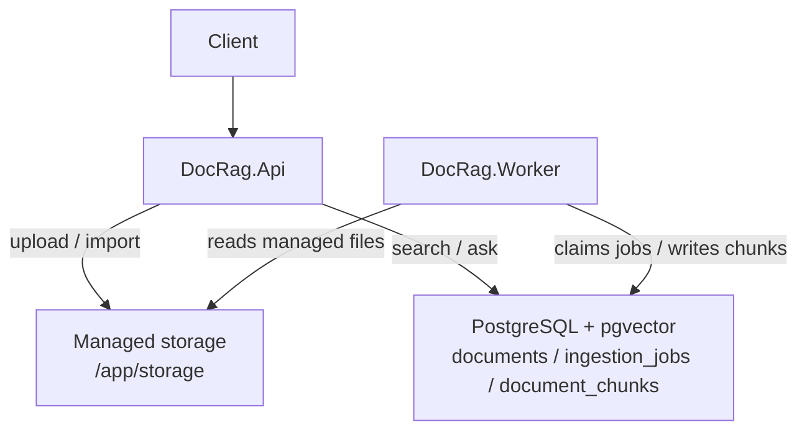

# dotnet-doc-rag

Self-hosted document-only RAG service built with .NET 10, ASP.NET Core Minimal API, PostgreSQL + pgvector, and a background ingestion worker.

## Overview

The service accepts supported text-bearing documents, copies them into managed storage, extracts text, chunks it, generates embeddings, stores vectors in PostgreSQL, and answers questions with citations from retrieved chunks.

## Architecture



## Requirements

- .NET SDK 10
- Docker Desktop or compatible Docker engine
- OpenAI API key for embeddings and answer generation

## Quickstart

```bash
cp .env.example .env
# edit .env and set OPENAI_API_KEY

docker compose up --build
```

Open docs at [http://localhost:8080/docs](http://localhost:8080/docs).

`DOC_RAG_API_KEY` is empty by default. Empty means local-open mode. Set a non-empty value to require `X-Api-Key` on non-health endpoints.

## Health

```bash
curl http://localhost:8080/health/ready
```

## Import samples

```bash
curl -X POST http://localhost:8080/api/documents/import-folder \
  -H "Content-Type: application/json" \
  -d '{"recursive":true}'
```

## Ask

```bash
curl -X POST http://localhost:8080/api/rag/ask \
  -H "Content-Type: application/json" \
  -d '{"question":"How many vacation days do employees receive?"}'
```

With API key enabled:

```bash
curl -X POST http://localhost:8080/api/rag/ask \
  -H "Content-Type: application/json" \
  -H "X-Api-Key: $DOC_RAG_API_KEY" \
  -d '{"question":"How many vacation days do employees receive?"}'
```

## Supported document types

- `.txt`
- `.md`
- `.pdf`
- `.docx`
- `.html`
- `.htm`
- `.csv`

## Import and storage lifecycle

- Files in `./samples` are mounted read-only into `/app/import` and are used only as import sources.
- Uploaded and imported files are copied into writable managed storage under `/app/storage/documents`.
- Temporary staged files are stored under `/app/storage/tmp`.
- Delete removes only the managed copy and never deletes import source files.

## Request bounds

- `topK` must be between `1` and `20`.
- `candidateK` defaults to `max(DefaultCandidateK, topK)` and must be between `topK` and `100`.
- `documentIds` may contain at most `50` unique IDs.

## Limitations

- No OCR
- No image, audio, or video ingestion
- No browser UI beyond Swagger/OpenAPI
- No cross-encoder reranking
- No multi-user auth or per-document ACLs

## Development

```bash
dotnet restore DotnetDocRag.slnx --configfile NuGet.Config
dotnet build DotnetDocRag.slnx
dotnet test DotnetDocRag.slnx
docker compose config
```
